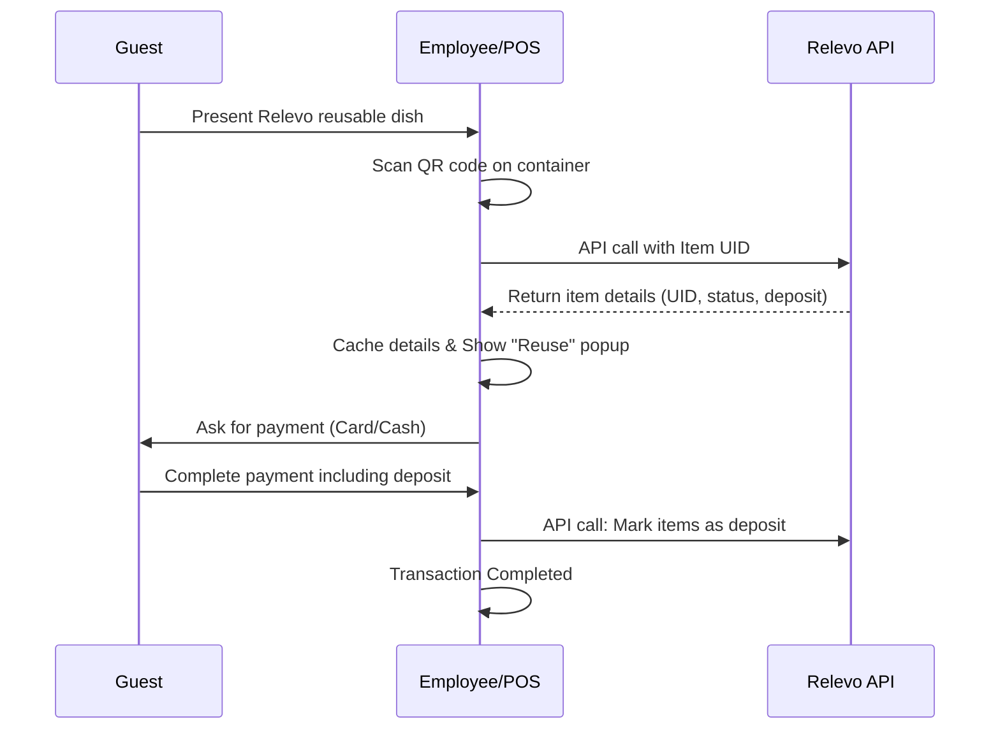

# Change Request (CR)

**Project Name:** NEW Relevo Plugin
**CR Title:** Generic Relevo Rental/Reusable System to TCPOS
**Date:** 2025-07-23
**Author:** Andreas Backes

## 1. Description
This request involves connecting the Relevo reusable packaging system to TCPOS via a secure, anonymous API connection. Relevo provides sustainable food and beverage containers that guests can borrow for up to 14 days. The integration allows TCPOS to track these items via QR codes, manage deposit bookings, and ensure privacy-compliant data transmission during the borrowing and return processes.

## 2. Business Value / Justification
* **Sustainability**: Provides an environmentally friendly alternative to single-use packaging in food service and delivery sectors.
* **Waste Reduction**: Promotes circular economy principles by incentivizing the return of reusable containers.
* **Market Alignment**: Targets the Hospitality and Canteen market (specifically Sodexo) within the EMEA region.
* **Efficiency**: Enables seamless integration with minimal on-site adjustments to existing workflows.

## 3. User Acceptance Criteria (UAC)
- [ ] **API Connectivity**: Establish a functional and secure anonymous API connection between Relevo and TCPOS.
- [ ] **QR Code Scanning**: Successfully scan item QR codes to retrieve UID, item name, type, status, deposit amount, and borrow duration.
- [ ] **Technical Deposit Booking**: Automatically book a technical deposit item when a Relevo container is scanned at the till.
- [ ] **Closed Loop Support**: Enable the deposit process specifically for employee cards (Sodexo case).
- [ ] **User Feedback**: Display a popup information box about "Reuse" to the employee after scanning.
- [ ] **Status Updates**: Call the Relevo API to mark items as "deposit" once the transaction is completed.
- [ ] **Hardware Compatibility**: Ensure the system works with 2D scanners connected to the POS.

## 4. Technical Context
* **Target Version**: TCPOS 8.1.x Master
* **API Reference**: [Sodexo API Guide](https://relevo.github.io/sodexo-api)
* **Identification**: Uses unique identifiers for locations, users, and items via QR codes.
* **Hardware**: Requires 2D scanners for QR code recognition at staffed checkouts and Vision Check Out (SCO).
* **Configuration**: Logic must be configured via the SCO/WOND API interface for automatic check-in/out.

### Workflow Diagram (Extracted)

## 5. Mockups / Visuals
*   **Sequence Diagram**: Illustrates the borrowing process.
*   **Process Flow**: Detailed flowchart for staffed checkout.
*   **Frontend**: "Relevo Transfer Button" and information popups.
