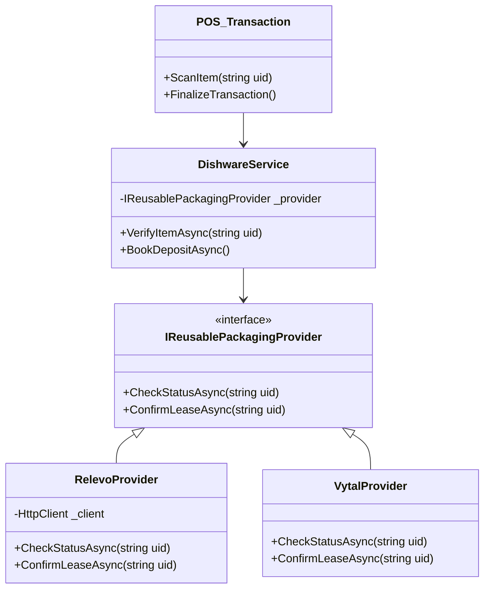

# Change Request (CR)

**Project Name:** POS Core - Sustainable Module
**CR Title:** Multipath Dishware Integration (Generic Reusable Packaging Middleware)
**Date:** 2026-01-13
**Author:** Strategy Team

## 1. Description
Instead of a point-to-point integration specifically for Relevo, this CR proposes the implementation of a **Generic Reusable Packaging Middleware** within the POS architecture. This middleware will serve as a simplified abstraction layer ("Multipath Dishware") that handles the lifecycle of reusable items (issue, return, deposit management) independent of the backend provider.

**Strategy**: "Build Once, Integrate Many".
We will implement the **Relevo** adapter as the pilot implementation, but the core database structures and business logic will be designed to support future additions like **Vytal** or **Recup** without changing the core POS code.

## 2. Business Value / Justification
*   **Scalability**: Adding a new provider (e.g., Vytal) in the future will take weeks instead of months.
*   **Reduced Tech Debt**: Avoids "spaghetti code" from multiple hardcoded 3rd-party integrations.
*   **Consistent UX**: Cashiers and customers get a unified experience regardless of the underlying packaging provider.
*   **Strategic Flexibility**: Allows the business to switch or support multiple sustainable partners simultaneously.

## 3. User Acceptance Criteria (UAC)
- [ ] **Middleware Architecture**: 
    - [ ] Create `IReusablePackagingProvider` interface (C#) in `TCPOS.Plugins.Interfaces`.
    - [ ] Use Dependency Injection (DI) to load the active provider at runtime.
- [ ] **Database Enhancements**:
    - [ ] Create `ProviderConfig` table in MSSQL (storing encrypted API keys).
    - [ ] **Offline**: Create connection-resilient `RentalQueue` table in local SQLite.
- [ ] **Relevo Adapter**: 
    - [ ] Implement `RelevoProvider : IReusablePackagingProvider`.
    - [ ] Use `HttpClientFactory` for typed Relevo API calls.
- [ ] **Configuration UI**: Add a WPF UserControl in the Backoffice to select the provider.
- [ ] **Offline Resilience**: The middleware must automatically queue failed requests to local SQLite and retry via background Worker.

## 4. Technical Context

### Architecture Pattern: C# Plugin w/ Dependency Injection
The POS Core interacts ONLY with the `DishwareService` (Singleton). The Service resolves the active `IReusablePackagingProvider` from the DI Container.

### Database Changes
*   **Table**: `Dishware_Providers` (ID, Name, Type, ConfigJSON, IsActive)
*   **Table**: `Dishware_Log` (TransactionID, ProviderID, ItemUID, ActionType, ResponseCode)

## 5. Mockups / Visuals
*   **Settings Screen**: A dropdown menu to select "Active Reusable Provider" (e.g., Relevo, Vytal).
*   **Generic Popup**: "Checking Item Status..." (instead of "Contacting Relevo...").
